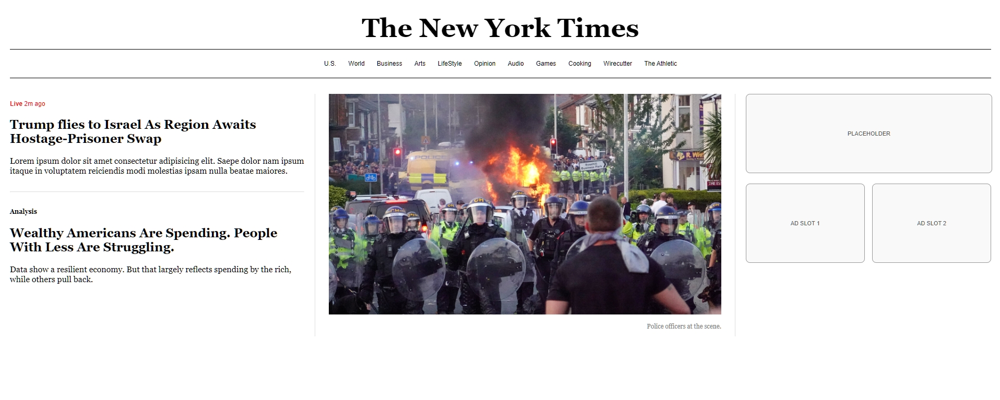

# New York Times Home Page Clone

A simple clone of the New York Times home page layout, created as a Lab Task/Assignment. This project focuses on learning the basics of HTML structure and CSS Flexbox layouts.

## 📝 Project Description

This website replicates the visual layout of the New York Times desktop home page. It demonstrates a classic newspaper-style grid with a navigation bar, a main news section, feature images, and a sidebar for widgets/ads.

**Key Goals:**
* Practice basic HTML tags (lists, divs, headings).
* Understand CSS Flexbox (`display: flex`) for column layouts.

## 🚀 Features

* **Classic Header:** NYT-style logo and date line.
* **Navigation Bar:** Double-bordered menu with hover effects.
* **3-Column Layout:**
    * **Left:** Top stories and analysis.
    * **Center:** Featured news image.
    * **Right:** Sidebar with widget placeholders and ad slots (gray boxes).
* **Responsive Images:** Images resize automatically to fit their container.

## 🛠️ Technologies Used

* **HTML5:** For the structural content.
* **CSS3:** For styling, colors, and layout (Flexbox).
* **No external frameworks** (Pure HTML/CSS).

## 💻 How to Run

1.  Clone or download this repository to your computer.
2.  Make sure the image file (`31uk-riot-wfqm-videoSixteenByNineJumbo1600-v3.jpg`) is in the same folder as `index.html`.
3.  Double-click `index.html` to open it in your web browser.

## 📸 Screenshots

## 👤 Author

* **[Md Sabbir Hossain]** - *Initial work for Lab Task*
